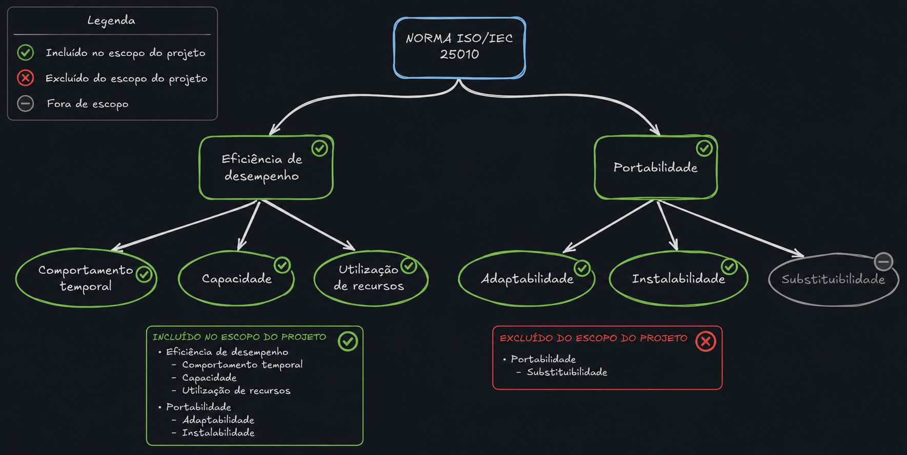

# 2.5 Modelo de Qualidade e Escopo

O objetivo desta página é representar o modelo de qualidade (ISO/IEC 25010) com foco em definir o escopo e a profundidade de análise para cada das características com maior prioridade que na norma se desdobram em subcaracterísticas como mostrado na figura 1, que são:  

- Eficiência de Desempenho
- Portabilidade

<em>Figura 1: Características de Qualidade Priorizadas e suas Subcaracterísticas (baseado na norma ISO/IEC 25010)</em>

## 2.5.1 Declaração Formal de Escopo e Profundidade

Para atender aos objetivos do projeto e às diretrizes de avaliação, declaramos formalmente os seguintes parâmetros para esta análise:

### Abrangência (Escopo)
O escopo desta avaliação limita-se à análise técnica do software **Ollama** operando como servidor de inferência local (uso *local-first*). A avaliação está restrita às duas características de qualidade da norma ISO/IEC 25010 consideradas mais críticas para este contexto de uso: **Eficiência de Desempenho** e **Portabilidade**. Aspectos secundários, como a infraestrutura em nuvem oferecida recentemente pela ferramenta ou características da norma como segurança e usabilidade, estão **fora do escopo** desta etapa.

### Profundidade
A profundidade da análise engloba as subcaracterísticas definidas como de alta relevância no cenário de uso definido em [Cenário de Avaliação](./proposito.md#22-cenario-de-avaliacao): Comportamento Temporal, Utilização de Recursos e Capacidade (para Eficiência de Desempenho); Adaptabilidade e Instalabilidade (para Portabilidade). A subcaracterística de Substituibilidade possui profundidade de análise reduzida devido à menor intenção de troca do produto pelos *stakeholders*. A avaliação empregará métricas baseadas na norma ISO/IEC 25021, validadas através de execuções reais de Modelos de Linguagem de Pequeno Porte (SLMs).

### Relação com Avaliações Futuras
As métricas e os resultados levantados nesta avaliação atuarão como *baseline* (linha de base) para as Fases 2, 3 e 4 do projeto. Avaliações futuras utilizarão esses dados fundamentais para realizar medições aprofundadas, planejar o monitoramento contínuo das subcaracterísticas, e expandir a análise para a comparação entre diferentes versões do software, arquiteturas de hardware e evolução natural do ecossistema de LLMs locais.

## 2.5.2 Relação entre Características Priorizadas e o Propósito

Para atender às diretrizes da avaliação, estabelecemos abaixo o vínculo direto entre as características de qualidade priorizadas e o propósito do projeto (detalhado em [Propósito da Avaliação](./proposito.md)):

**Tabela 1: Vínculo entre caracteríscticas**

| Característica Priorizada | Vínculo Explícito com o Propósito Declarado |
| :--- | :--- |
| **Eficiência de Desempenho** | Responde diretamente à necessidade de validar se o Ollama possui "**tempo de resposta aceitável em hardware básico**". Garante que estudantes sem acesso à nuvem possam processar IA localmente sem inviabilizar o uso do computador (Utilização de Recursos e Comportamento Temporal). |
| **Portabilidade** | Responde diretamente à exigência de que "**a experiência de instalação e adaptação seja equivalente entre sistemas operacionais**". Garante que a ferramenta seja universalmente acessível tanto para usuários de Windows quanto de Linux (Instalabilidade e Adaptabilidade). |

<b>Autores:</b> <a href="https://github.com/GDveAlves">Gabriel Alves</a> e <a href="https://github.com/Matheus-06">Matheus Pinheiro</a>, 2026.

## 2.5.3 Eficiência de Desempenho

> **definição segundo a norma:** desempenho relativo à quantidade de recursos usados sob condições declaradas.
>> NOTA : Recursos podem incluir outros produtos de software, a configuração de software e hardware do sistema, e materiais (ex. papel para impressão, mídia de armazenamento).

tabela com as subcaracterísticas relevantes para eficiência de desempenho:

**Tabela 2: Subcaracterísticas**

| Subcaracterística | Descrição (SQuaRE) | Relevância para o projeto (1-5) | Justificativa para a relevância |
|-------------------|--------------------|---------------------------------| --------------------------------|
| Comportamento temporal | grau em que os tempos de resposta e processamento e as taxas de transferência de um produto ou sistema, ao executar suas funções, atendem aos requisitos. | 5 | Tem influência direta na experiência dos stakeholders na execução. |
| Utilização de recursos | grau em que as quantidades e tipos de recursos usados por um produto ou sistema, ao executar suas funções, atendem aos requisitos. | 5 | Os recursos utilizados devem ser otimizados para garantir o desempenho adequado, segundo o cenário de uso. |
| Capacidade | grau em que os limites máximos de um parâmetro de produto ou sistema atendem aos requisitos. | 5 | Impacta diretamente na capacidade do sistema de atender às necessidades dos stakeholders. |

<b>Autores:</b> <a href="https://github.com/GDveAlves">Gabriel Alves</a> e <a href="https://github.com/Matheus-06">Matheus Pinheiro</a>, 2026.

## 2.5.4 Portabilidade

> **definição segundo a norma:** grau de eficácia e eficiência com que um sistema, produto ou componente pode ser transferido de um ambiente operacional ou de uso para outro.
>> NOTA 1 Adaptado de ISO/IEC/IEEE 24765.

>> NOTA 2 Portabilidade pode ser interpretada como uma capacidade inerente do produto ou sistema para facilitar as atividades de portabilidade, ou a qualidade em uso experimentada para o objetivo de portar o produto ou sistema.

tabela com as subcaracterísticas relevantes para portabilidade:

**Tabela 3: portabilidade**

| Subcaracterística | Descrição (SQuaRE) | Relevância para o projeto (1-5) | Justificativa para a relevância |
|-------------------|--------------------|---------------------------------| --------------------------------|
| Adaptabilidade | grau em que um produto ou sistema pode ser adaptado de forma eficaz e eficiente para diferentes ou evoluindo hardware, software ou outros ambientes operacionais ou de uso. | 5 | De grande relevância para o projeto, pois permite a adaptação do sistema a diferentes ambientes. |
| Instalabilidade | grau de eficácia e eficiência com que um produto ou sistema pode ser instalado e ou desinstalado com sucesso em um ambiente especificado. | 5 | Relevante para a análise do projeto, pois impacta na facilidade de implantação. |
| Substituibilidade | grau em que um produto pode substituir outro produto de software especificado para o mesmo propósito no mesmo ambiente. | 2 | Para a análise do projeto, a substituibilidade é de menor relevância, pois os stakeholders não têm pretenção de substituir o produto por outro. |

<b>Autores:</b> <a href="https://github.com/GDveAlves">Gabriel Alves</a> e <a href="https://github.com/Matheus-06">Matheus Pinheiro</a>, 2026.

---

## Bibliografia

> 1. ISO/IEC 25010 *Software engineering – Software product Quality Requirements and Evaluation
(SQuaRE) – Quality model.*
<https://www.iso.org/standard/35733.html>
> 2. ISO/IEC 25021 *Software engineering - Software product Quality Requirements and Evaluation
(SQuaRE) – Quality measure elements.*
<https://www.iso.org/standard/35745.html>

---

## Histórico de Versão

| Versão | Data | Descrição | Autor | Revisor |
|--------|------|-----------|-------|---------|
| 1.0 | 12/05/2026 | Criação da página de escopo e modelos (Eficiência de desempenho e Portabilidade) | [Gabriel Alves](https://github.com/GdevAlves) | [Matheus Pinheiro](https://github.com/matheus-06) |
|1.1|13/05/2026|Adição do histórico de versão e referências|[Matheus Pinheiro](https://github.com/matheus-06)|[Gabriel Alves](https://github.com/GdevAlves)|
| 1.2 |13/05/2026|Adição de justificativas para a relevância das subcaracterísticas|[Gabriel Alves](https://github.com/GdevAlves)|[Matheus Pinheiro](https://github.com/matheus-06) e [Renata Quadros](https://github.com/RenataKurzawa)|
| 1.3 |29/05/2026|Correção de links e títulos e adição de referências|[Gabriel Alves](https://github.com/GdevAlves)|[Matheus Pinheiro](https://github.com/matheus-06) e [Renata Quadros](https://github.com/RenataKurzawa)|