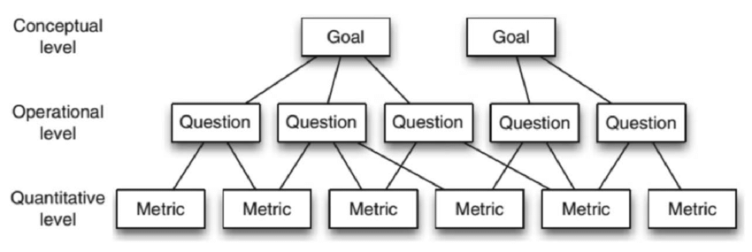

# 3 · Fase 2

## 3.1. Sobre a Fase 2

Nesta etapa do projeto, adotaremos a abordagem metodológica GQM (*Goal-Question-Metric*) para estruturar a avaliação da qualidade do software Ollama executando o modelo Qwen 2.5-3B localmente. O propósito fundamental desta fase é traduzir os objetivos de qualidade estabelecidos na Fase 1 em questões específicas e métricas quantificáveis, assegurando uma análise prática, rigorosa e fundamentada cientificamente. 

A partir da delimitação do escopo, o foco da qualidade do objeto em medição restringe-se às características de **Eficiência de Desempenho** e **Portabilidade**. A aplicação do GQM servirá como base para as futuras fases de coleta de dados e para a interpretação dos resultados empíricos relacionados ao comportamento do sistema.

## 3.2. Estruturação segundo o Método GQM

O método GQM, sigla para Objetivo-Questão-Métrica, é uma abordagem top-down que garante que toda medição de software seja estritamente orientada por um objetivo claro, evitando a coleta de dados sem propósito analítico. Durante a Fase 2 (fase de Definição), o GQM é organizado em um fluxo hierárquico de três níveis:

*   **Nível Conceitual (Goal / Objetivo):** Representa o nível mais alto, definindo o "porquê" da medição. No contexto deste trabalho, o objetivo é compreender e metrificar o comportamento do Ollama no que tange à sua eficiência e portabilidade.
*   **Nível Operacional (Question / Questão):** Detalha o que é necessário investigar para determinar se a meta conceitual foi atingida. As questões decompõem as características de qualidade em componentes investigáveis (ex: Qual o esforço de instalação em diferentes SOs?).
*   **Nível Quantitativo (Metric / Métrica):** Representa a base do processo, estabelecendo as fórmulas e coletas exatas que fornecerão os dados para responder objetivamente a cada questão. Além disso, neste nível são formuladas as *hipóteses de baseline*, que guiarão a interpretação futura.

Figura 1: Imagem Ilustrativa da Estrutura do GQM

## 3.3. Artefatos e Páginas Projetadas

Para contemplar o escopo da avaliação e a estruturação exigida pelo método GQM, os artefatos desta segunda fase serão divididos e documentados nas seguintes páginas:

*   **Introdução:** O presente artefato, destinado a apresentar a metodologia GQM adotada pela equipe, conceituar seus níveis hierárquicos e mapear a organização dos documentos que compõem a Fase 2.
*   **Eficiência de Desempenho:** Página dedicada à aplicação estruturada do GQM para os parâmetros de desempenho do software. Abordará a definição formal de objetivos, questões, métricas e hipóteses focadas no tempo de resposta (como o *Time to First Token* - TTFT) e na utilização de recursos do modelo Qwen2.5-3b rodando no motor do Ollama.
*   **Portabilidade:** Página dedicada à aplicação do GQM para a adaptabilidade do sistema. Conterá a definição de metas, perguntas e métricas estritamente voltadas para avaliar o esforço de instalação, a complexidade de configuração e a capacidade de execução do Ollama em diferentes sistemas operacionais e hardwares de consumo.
*   **Tabela de Contribuição:** Documento destinado ao registro formal da divisão de tarefas. Apresentará as descrições das atividades realizadas e o percentual de contribuição individual de cada membro da equipe durante o desenvolvimento dos artefatos da Fase 2.

  <a class="section-card" href="./">
    <h3>3.1 Introdução</h3>
    

  </a>
  <a class="section-card" href="eficiencia/">
    <h3>3.2 Eficiência de Desempenho</h3>
    

  </a>
  <a class="section-card" href="portabilidade/">
    <h3>3.3 Portabilidade</h3>
    

  </a>
  <a class="section-card" href="contribuicao/">
    <h3>3.4 Tabela de Contribuição</h3>
    

  </a>

